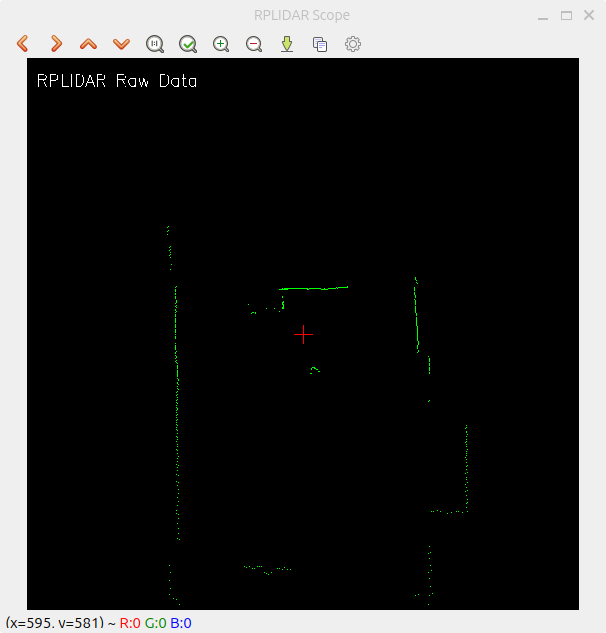

# RPLIDAR ROS2 Visualizer

Visualize RPLIDAR laser scans in real-time. Install ROS2 globally, clone/build the official RPLIDAR driver, then run `ros2 launch test.launch.py`. A 600x600 window shows laser points (green) with robot at center (red crosshair). Requires OpenCV and numpy.

